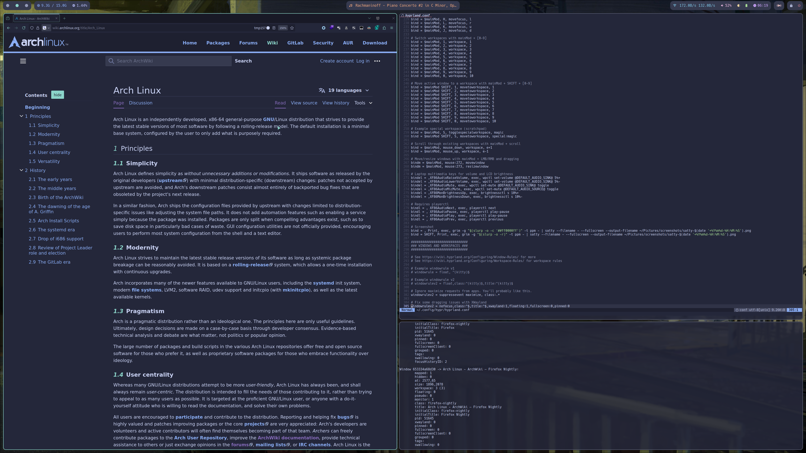
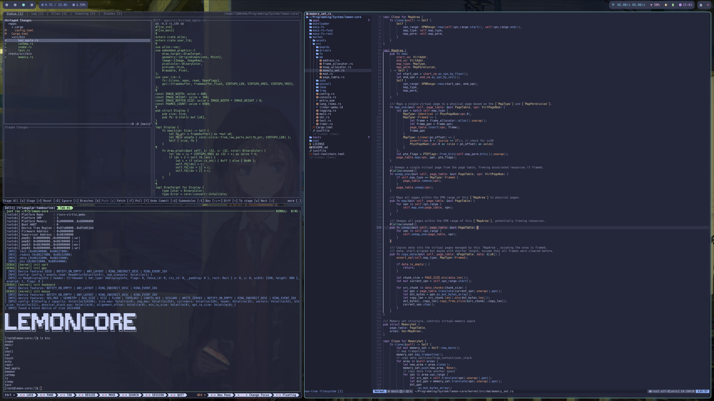

# 13m0n4de's Dotfiles

[English](./README.md) | [中文](./README.zh.md)

My personal dotfiles repository managed with [YADM](https://yadm.io/).

> [!NOTE]
> This dotfiles is migrating to Guix OS (see [`guix`](https://github.com/13m0n4de/dotfiles/tree/guix) branch).
>
> After the migration, this branch won't receive major updates (such as software replacements or significant visual changes). Until then, it will be actively maintained.

## 📸 Preview

## 🎨 Theme

- **Color Scheme**: [Catppuccin](https://github.com/catppuccin/)
    - Flavor: Macchiato
    - Accent: Teal
- **Icon Theme**: [Papirus Dark](https://github.com/PapirusDevelopmentTeam/papirus-icon-theme/)
- **Cursor Theme**: [Catppuccin](https://github.com/catppuccin/cursors/)
- **Terminal Font**: [Hack Nerd Font](https://github.com/ryanoasis/nerd-fonts/tree/master/patched-fonts/Hack)
- **System Font**: [Source Han Sans](https://github.com/adobe-fonts/source-han-sans)
- **Wallpaper**: Artwork by [shionnn_k](https://x.com/shionnn_k)

## 💻 System Information

- **Distribution**: [Arch Linux](https://archlinux.org/)
- **Display Manager**: [ly](https://github.com/fairyglade/ly)
- **Window Manager**: [Hyprland](https://hyprland.org/)
- **Status Bar**: [Waybar](https://github.com/Alexays/Waybar/)
- **Notification Daemon**: [Mako](https://github.com/emersion/mako)
- **Screen Locker**: [Hyprlock](https://github.com/hyprwm/hyprlock)
- **System Menu**: [nwg-bar](https://github.com/nwg-piotr/nwg-bar)
- **Input Method**: [Fcitx5](https://fcitx-im.org/) + [Rime](https://rime.im/) + [雾凇拼音](https://github.com/iDvel/rime-ice)
- **Wallpaper Manager**: [Hyprpaper](https://github.com/hyprwm/hyprpaper)
- **Launcher**: [Rofi](https://github.com/davatorium/rofi)
- **Terminal**: [Alacritty](https://alacritty.org/) + [Zellij](https://github.com/zellij-org/zellij)
- **Shell**: [Fish](https://fishshell.com/) + [Starship](https://starship.rs/)
- **Editor**: [Neovim](https://neovim.io/) (configurations in [separate repository](https://github.com/13m0n4de/nvim))
- **File Manager**: [Yazi](https://github.com/sxyazi/yazi/)
- **System Monitor**: [Btop](https://github.com/aristocratos/btop)
- **Screenshot**: [grim](https://git.sr.ht/~emersion/grim) + [slurp](https://github.com/emersion/slurp) + [satty](https://github.com/gabm/satty)
- **Screen Recording**: [OBS](https://obsproject.com/)
- **Dotfiles Manager**: [YADM](https://yadm.io/)

## 📝 Notes

This dotfiles repository aims to achieve a good visual experience with "relatively minimal" (not to the extreme) setup. It prefers lightweight and simple applications, avoids complex animations, and does not include light/dark theme switching.

This dotfiles migrated from i3(X11) to Hyprland(Wayland). While it may retain some i3 operation habits, all related software has been carefully re-selected and the old configurations have been refactored.

Most theme files are from Catppuccin's official repositories. Unmodified theme files are not tracked in the repository but are downloaded and installed through YADM's bootstrap script.

Some themes, such as Firefox themes, user styles, and other applications, cannot be easily installed via YADM. These are not included in the repository but use the same color scheme. Manual installation might be required to achieve the same look as shown in the previews.

My scaling factor is quite small, which is evident from the preview images. I cannot guarantee that some components (like Waybar) will display properly under different scaling factors.

## 📜 License

This project is licensed under the MIT License - see the [LICENSE](./LICENSE) file for details.

---

💡 If you find these configurations helpful, feel free to give it a Star ⭐
