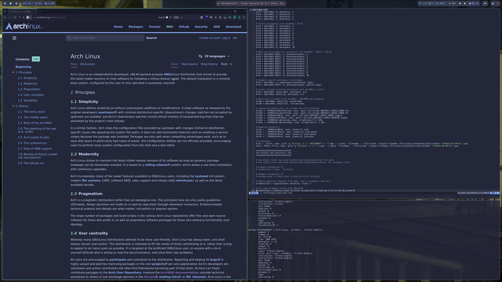
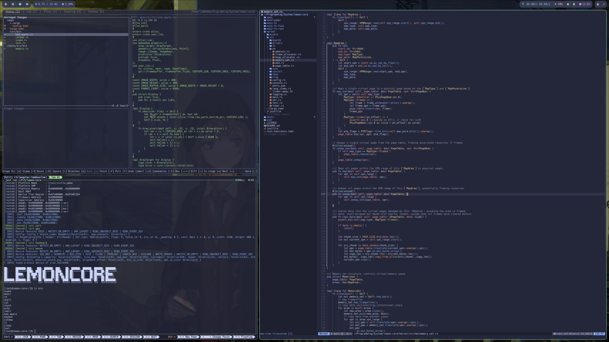

# 13m0n4de's Dotfiles

[English](./README.md) | [中文](./README.zh.md)

我的个人 Dotfiles 仓库，使用 [YADM](https://yadm.io/) 进行管理。

> [!NOTE]
>
> 这份配置正在迁移至 Guix OS。
>
> 迁移完成后，此分支将不会有大规模更新（如更换软件、大幅修改显示效果等）。在此之前，这里会持续更新维护。

## 预览

## 主题

- **配色方案**：[Catppuccin](https://github.com/catppuccin/)
  - 风味：Macchiato
  - 强调色：Teal
- **图标主题**: [Papirus Dark](https://github.com/PapirusDevelopmentTeam/papirus-icon-theme/)
- **光标主题**: [Catppuccin](https://github.com/catppuccin/cursors/)
- **终端字体**：[Hack Nerd Font](https://github.com/ryanoasis/nerd-fonts/tree/master/patched-fonts/Hack)
- **系统字体**：[Source Han Sans](https://github.com/adobe-fonts/source-han-sans)
- **壁纸作者**：[shionnn_k](https://x.com/shionnn_k)

## 系统信息

- **发行版**：[Arch Linux](https://archlinux.org/)
- **显示管理器**：[ly](https://github.com/fairyglade/ly)
- **窗口管理器**：[Hyprland](https://hyprland.org/)
- **状态栏**：[Waybar](https://github.com/Alexays/Waybar/)
- **通知守护程序**：[Mako](https://github.com/emersion/mako)
- **锁屏程序**：[Hyprlock](https://github.com/hyprwm/hyprlock)
- **系统菜单**：[nwg-bar](https://github.com/nwg-piotr/nwg-bar)
- **输入法**：[Fcitx5](https://fcitx-im.org/) + [Rime](https://rime.im/) + [雾凇拼音](https://github.com/iDvel/rime-ice)
- **壁纸管理器**：[Hyprpaper](https://github.com/hyprwm/hyprpaper)
- **启动器**：[Rofi](https://github.com/davatorium/rofi)
- **终端**: [kitty](https://github.com/kovidgoyal/kitty/)
- **Shell**：[Fish](https://fishshell.com/) + [Starship](https://starship.rs/)
- **编辑器**：[Neovim](https://neovim.io/)（配置在[单独的仓库](https://codeberg.com/13m0n4de/nvim)中）
- **文件管理器**：[Yazi](https://github.com/sxyazi/yazi/)
- **系统监视器**：[Btop](https://github.com/aristocratos/btop)
- **截图工具**：[grimblast](https://github.com/hyprwm/contrib/tree/main/grimblast) ([grim](https://git.sr.ht/~emersion/grim) + [slurp](https://github.com/emersion/slurp)) + [satty](https://github.com/gabm/satty)
- **录屏工具**：[OBS](https://obsproject.com/)
- **配置管理器**：[YADM](https://yadm.io/)

## 注意事项

这套配置以简洁实用为主，但不刻意追求极简。我更偏好轻量、功能直接的软件，不会添加复杂的页面动效，也没有亮暗色切换功能

配置最初用于 i3/X11，后来迁移到了 Hyprland/Wayland。快捷键和操作逻辑仍保留了一些 i3 的使用习惯，其余部分则针对 Wayland 环境重新整理。

大部分主题取自 Catppuccin 官方仓库。未作修改的主题文件不会纳入版本控制，由 YADM 的 Bootstrap 脚本自动下载和安装。

一些主题无法或很难使用 YADM 安装，如 Firefox 和 User Styles，它们将不包含在仓库内，但都使用同样的主题配色，需要手动安装才能还原预览图里的效果。

我的缩放比很小，这点从预览图就能看出来，我没法确定一些组件（如 Waybar）能在其他缩放比下正常显示。
